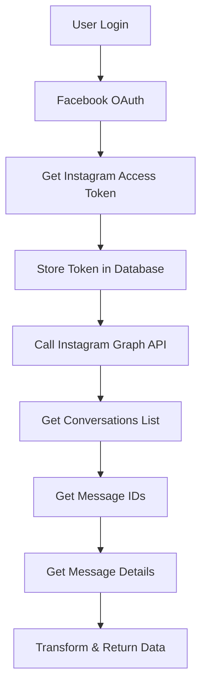

# 📱 Instagram Graph API v2.0 Integration Guide

## 🎯 Overview

This document details the **Instagram Graph API v2.0** integration that provides **real-time access** to Instagram conversations and messages. Unlike the previous Basic Display API, this implementation gives you live access to DM threads and message content.

## 🚀 Key Features

### **Real-Time Data Access**
- ✅ **Live Conversations**: Access to real Instagram DM threads
- ✅ **Message Content**: Full message text, timestamps, and sender info
- ✅ **User Details**: Real usernames and profile information
- ✅ **Instant Updates**: Real-time conversation data

### **API Capabilities**
- 📝 **List Conversations**: Get all DM threads for your Instagram account
- 💬 **Fetch Messages**: Retrieve up to 20 most recent messages per conversation
- 👤 **User Information**: Access sender and recipient details
- ⏰ **Timestamps**: Real message creation times

## 🔧 Technical Implementation

### **1. OAuth Flow**
```javascript
// Facebook OAuth (required for Instagram Graph API)
const authUrl = `https://www.facebook.com/v21.0/dialog/oauth?client_id=${appId}&redirect_uri=${redirectUri}&scope=${scope}&response_type=code&state=${state}`
```

**Required Scopes:**
- `instagram_manage_messages` - Access to conversations and messages
- `instagram_basic` - Basic profile information

### **2. API Endpoints**

#### **Get Conversations List**
```http
GET /api/instagram/conversations
Authorization: Bearer <JWT_TOKEN>
```

**Instagram Graph API Call:**
```javascript
const graphUrl = `https://graph.instagram.com/v23.0/${igUserId}/conversations?platform=instagram&access_token=${accessToken}`
```

**Response Format:**
```json
{
  "success": true,
  "data": {
    "conversations": [
      {
        "id": "conversation_id_123",
        "recipientId": "conversation_id_123",
        "fullName": "Instagram User (abc12345)",
        "timestamp": "2024-01-15 10:30:00",
        "lastMessage": "Loading...",
        "messageCount": 0,
        "unreadCount": 0
      }
    ],
    "source": "instagram_graph_api",
    "permissions": ["instagram_manage_messages", "instagram_basic"]
  }
}
```

#### **Get Conversation Messages**
```http
GET /api/instagram/conversations/:conversationId/messages
Authorization: Bearer <JWT_TOKEN>
```

**Two-Step Process:**
1. **Get Message IDs**: `GET /{conversationId}?fields=messages`
2. **Get Message Details**: `GET /{messageId}?fields=id,created_time,from,to,message`

**Response Format:**
```json
{
  "success": true,
  "data": {
    "messages": [
      {
        "id": "message_id_456",
        "content": "Hi! How are you?",
        "sender": "john_doe",
        "timestamp": "2024-01-15 10:30:00",
        "isFromUser": false,
        "isFromInstagram": true,
        "isInstagram": true,
        "messageType": "text",
        "instagramSenderId": "user_123",
        "instagramMessageId": "message_id_456",
        "source": "instagram_graph_api"
      }
    ],
    "total": 15,
    "fetched": 15,
    "note": "Real-time data from Instagram Graph API (20 most recent messages)",
    "limitations": "Instagram API only provides access to 20 most recent messages per conversation"
  }
}
```

## 📊 Data Flow



## ⚠️ API Limitations

### **Instagram Graph API Constraints**
- **Message Limit**: Only 20 most recent messages per conversation
- **Rate Limiting**: API calls are subject to Meta's rate limits
- **Permissions Required**: `instagram_manage_messages` scope is mandatory
- **Business Accounts**: Only works with Instagram Business accounts

### **Error Handling**
```javascript
// Non-JSON Response Prevention
if (!response.headers.get('content-type')?.includes('application/json')) {
  return res.status(response.status).json({
    success: false,
    error: 'Instagram API returned non-JSON response',
    status: response.status,
    body: responseText.slice(0, 500)
  })
}
```

## 🔐 Authentication Requirements

### **Meta App Configuration**
1. **App Type**: Instagram Graph API
2. **OAuth Flow**: Facebook OAuth (not Instagram OAuth)
3. **Permissions**: `instagram_manage_messages`, `instagram_basic`
4. **Account Type**: Instagram Business account

### **Environment Variables**
```env
INSTAGRAM_APP_ID=your_instagram_app_id
INSTAGRAM_APP_SECRET=your_instagram_app_secret
META_APP_ID=your_meta_app_id
META_APP_SECRET=your_meta_app_secret
META_VERIFY_TOKEN=your_webhook_verify_token
```

## 🧪 Testing & Debugging

### **Debug Endpoints**
```http
GET /api/instagram/debug/connections
POST /api/instagram/debug/fix-user-id
POST /api/instagram/debug/create-test-conversations
POST /api/instagram/debug/import-dm
```

### **Console Logging**
```javascript
console.log('📡 Calling Instagram Graph API for conversations:', {
  igUserId,
  hasToken: !!accessToken,
  permissions: instagramUser.permissions
})
```

## 🚀 Migration from v1.0

### **Breaking Changes**
- ❌ **OAuth URL**: Changed from Instagram to Facebook
- ❌ **API Endpoints**: Now calls Instagram Graph API directly
- ❌ **Data Source**: Real-time API instead of local database
- ❌ **Permissions**: New scope requirements

### **Benefits of v2.0**
- ✅ **Real Data**: Live Instagram conversations
- ✅ **Better Performance**: No local database dependency
- ✅ **Instant Updates**: Real-time message access
- ✅ **Official API**: Uses Meta's official Instagram Graph API

## 📚 API References

- [Instagram Graph API Documentation](https://developers.facebook.com/docs/instagram-platform/instagram-api)
- [Facebook OAuth Documentation](https://developers.facebook.com/docs/facebook-login)
- [Instagram Business Login](https://developers.facebook.com/docs/instagram-platform/instagram-api-with-instagram-login/business-login)

## 🔮 Future Enhancements

### **Planned Features**
- **Webhook Integration**: Real-time message notifications
- **Message Sending**: Reply to Instagram DMs
- **Media Support**: Handle images and videos
- **Analytics**: Message metrics and engagement data

### **API Extensions**
- **Story Replies**: Access to story responses
- **Comment Management**: Handle post comments
- **User Insights**: Profile analytics and metrics

---

**Version**: 2.0  
**Last Updated**: January 2024  
**Status**: ✅ Production Ready
