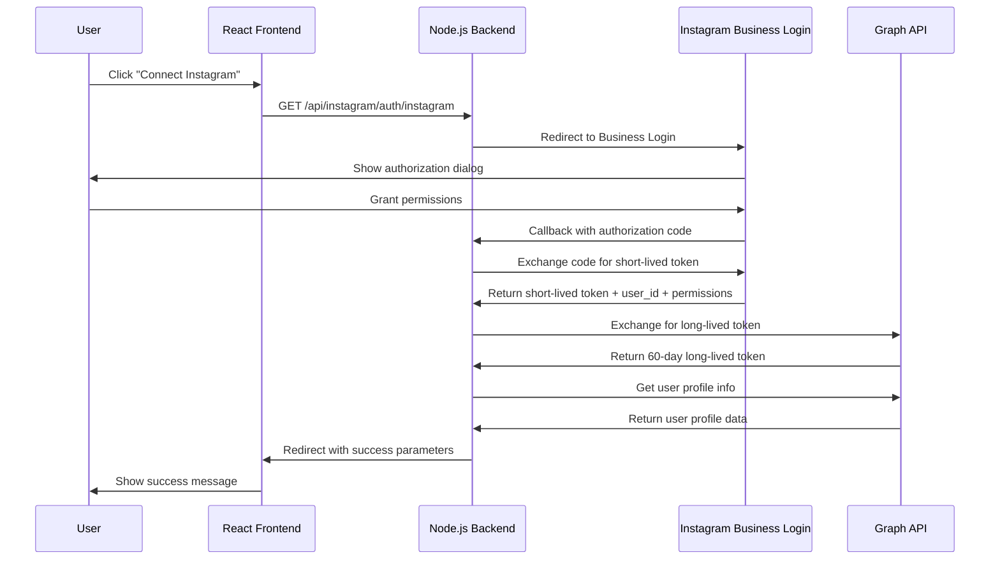

# 🚀 Instagram Business Login API Integration Update

**Updated InstantChat to use Instagram Business Login API instead of Meta OAuth 2.0**

## 📋 Overview

This update migrates the InstantChat platform from using Meta OAuth 2.0 to the new **Instagram Business Login API**, providing a more direct and streamlined authentication flow for Instagram business accounts.

## 🔄 What Changed

### **Backend Changes**

#### 1. **Updated Authentication Flow** (`server/routes/instagram.js`)
- **Old**: Instagram Basic Display API with `user_profile,user_media` scopes
- **New**: Instagram Business Login API with business-specific scopes:
  - `instagram_business_basic` - Basic profile access
  - `instagram_business_manage_messages` - Send/receive messages
  - `instagram_business_manage_comments` - Manage comments
  - `instagram_business_content_publish` - Publish content

#### 2. **New Token Exchange Methods** (`server/utils/metaApi.js`)
- `exchangeInstagramBusinessToken()` - Exchange authorization code for short-lived token
- `exchangeForLongLivedInstagramToken()` - Convert to 60-day long-lived token
- `refreshInstagramToken()` - Refresh long-lived tokens

#### 3. **Enhanced Security**
- CSRF protection with state parameter validation
- Proper error handling for authorization failures
- Long-lived token management (60-day validity)

### **Frontend Changes**

#### 1. **Updated ConnectInstagram.jsx**
- Updated messaging to reflect Instagram Business Login
- Enhanced feature descriptions:
  - Message management
  - Comment moderation
  - Content publishing
- Improved user experience with business-focused features

#### 2. **Updated Dashboard.jsx**
- Modified success message handling for new response format
- Added support for permissions display
- Enhanced error handling for failed connections

### **Configuration Changes**

#### 1. **Environment Variables** (`env.example`)
- Updated scope configuration
- Added detailed comments for each permission
- Clarified redirect URI format

## 🔧 Technical Implementation

### **Authentication Flow**



### **Key API Endpoints**

#### **Authorization URL**
```
https://www.instagram.com/oauth/authorize?
  client_id={APP_ID}&
  redirect_uri={REDIRECT_URI}&
  scope=instagram_business_basic,instagram_business_manage_messages,instagram_business_manage_comments,instagram_business_content_publish&
  response_type=code&
  state={CSRF_TOKEN}
```

#### **Token Exchange**
```
POST https://api.instagram.com/oauth/access_token
Content-Type: application/x-www-form-urlencoded

client_id={APP_ID}&
client_secret={APP_SECRET}&
grant_type=authorization_code&
redirect_uri={REDIRECT_URI}&
code={AUTHORIZATION_CODE}
```

#### **Long-lived Token Exchange**
```
GET https://graph.instagram.com/access_token?
  grant_type=ig_exchange_token&
  client_secret={APP_SECRET}&
  access_token={SHORT_LIVED_TOKEN}
```

## 🎯 Benefits

### **For Users**
- **Simplified Authentication**: Direct Instagram login without Facebook dependency
- **Business-Focused Features**: Access to Instagram business tools and analytics
- **Enhanced Security**: Long-lived tokens with proper refresh mechanisms
- **Better Permissions**: Granular control over what the app can access

### **For Developers**
- **Cleaner API**: More straightforward authentication flow
- **Better Documentation**: Instagram Business Login is well-documented
- **Future-Proof**: Uses the latest Instagram API standards
- **Enhanced Capabilities**: Access to advanced Instagram business features

## 🔒 Security Improvements

1. **CSRF Protection**: State parameter validation prevents cross-site request forgery
2. **Token Management**: Proper handling of short-lived and long-lived tokens
3. **Error Handling**: Comprehensive error responses and user feedback
4. **Scope Validation**: Granular permissions with clear purpose definitions

## 📚 API Reference Links

- [Instagram Business Login Documentation](https://developers.facebook.com/docs/instagram-platform/instagram-api-with-instagram-login/business-login)
- [Instagram Graph API](https://developers.facebook.com/docs/instagram-api)
- [Token Management](https://developers.facebook.com/docs/instagram-platform/instagram-api-with-instagram-login/business-login#step-3--get-a-long-lived-access-token)

## 🚀 Migration Impact

### **Backward Compatibility**
- Old Instagram Basic Display connections may need to be re-authorized
- Users will need to reconnect their Instagram accounts
- Database schema remains compatible with minor field additions

### **Required Actions**
1. **Update environment variables** with Instagram-specific credentials:
   ```bash
   INSTAGRAM_APP_ID=1192283755959700
   INSTAGRAM_APP_SECRET=ff5ab9a5cc8d2cc0edbae5fb7c9c0b71
   ```
2. **Verify Meta App Dashboard** has Instagram Business Login configured
3. Test the new authentication flow with Instagram App ID
4. Notify users about the improved Instagram integration
5. Monitor for any authentication issues during rollout

## ✅ Testing Checklist

- [ ] Instagram Business Login authorization flow works
- [ ] Token exchange completes successfully  
- [ ] Long-lived token generation works
- [ ] User profile information is retrieved
- [ ] Success/error states display correctly
- [ ] CSRF protection prevents unauthorized requests
- [ ] Permissions are properly displayed to users

## 🔄 Next Steps

1. **Deploy Changes**: Update production environment with new configuration
2. **User Communication**: Inform users about the enhanced Instagram integration
3. **Monitor Performance**: Track authentication success rates and user feedback
4. **Feature Enhancement**: Leverage new business permissions for advanced features

---

**Note**: This update aligns InstantChat with Instagram's latest API standards and provides a foundation for advanced Instagram business features and automation capabilities.
