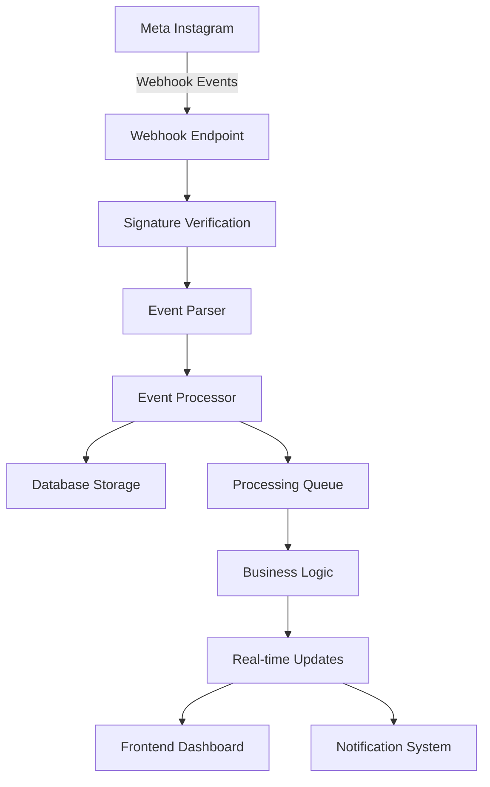

# 🔗 Webhooks Management System - InstantChat

## 🎯 Overview

The **Webhooks Management System** is a comprehensive solution for handling Instagram webhook events in real-time. It provides secure webhook reception, event processing, storage, and real-time notifications for all Instagram interactions including comments, messages, mentions, and reactions.

## 🚀 Key Features

### **Real-Time Event Processing**
- ✅ **Instant Webhook Reception**: Handle Meta webhook verification and event delivery
- ✅ **Event Parsing**: Extract and validate Instagram event data
- ✅ **Queue Management**: Batch processing with retry mechanisms
- ✅ **Real-Time Notifications**: Live updates in the InstantChat dashboard

### **Supported Event Types**
- 📝 **Messages**: Direct messages and conversations
- 💬 **Comments**: Post and story comments
- 🔴 **Live Comments**: Real-time comments during live broadcasts
- ❤️ **Message Reactions**: Reactions to messages (like, love, etc.)
- 📱 **Message Postbacks**: Button interactions and quick replies
- 🔗 **Message Referrals**: Referral traffic and sources
- 👁️ **Message Seen**: Read receipts and engagement tracking
- 📢 **Mentions**: User mentions in posts, stories, and comments

### **Security & Reliability**
- 🔐 **Signature Verification**: X-Hub-Signature-256 validation
- 🚫 **Deduplication**: Prevent duplicate event processing
- 🔄 **Retry Logic**: Automatic retry for failed events
- 📊 **Error Tracking**: Comprehensive error logging and monitoring

## 🏗️ Architecture

### **System Components**



### **Data Flow**
1. **Meta sends webhook** → Instagram event occurs
2. **Signature verification** → Validate request authenticity
3. **Event parsing** → Extract structured data
4. **Database storage** → Store event with metadata
5. **Queue processing** → Add to processing queue
6. **Business logic** → Execute event-specific actions
7. **Real-time updates** → Update frontend and send notifications

## 🔧 Technical Implementation

### **Backend Services**

#### **1. WebhookProcessor Service**
```javascript
// Core webhook processing logic
class WebhookProcessor {
  // Signature verification
  verifySignature(payload, signature, appSecret)
  
  // Event processing
  processWebhook(payload, headers, query)
  
  // Queue management
  addToQueue(webhookEvent)
  processQueue()
  
  // Business logic execution
  executeBusinessLogic(webhookEvent)
}
```

#### **2. Database Models**

**WebhookEvent Schema:**
```javascript
{
  eventId: String,           // Unique event identifier
  eventType: String,         // Type of Instagram event
  accountId: String,         // Instagram account ID
  senderId: String,          // Event sender ID
  recipientId: String,       // Event recipient ID
  payload: Mixed,            // Raw event payload
  content: {                 // Extracted content
    text: String,
    mediaUrl: String,
    mediaType: String
  },
  userInfo: {                // User information
    username: String,
    fullName: String,
    profilePicture: String
  },
  processedStatus: String,   // Processing status
  deduplicationKey: String  // Duplicate prevention
}
```

**WebhookSubscription Schema:**
```javascript
{
  subscriptionId: String,    // Unique subscription ID
  instagramAccountId: String, // Instagram account
  userId: String,            // InstantChat user
  subscribedFields: Array,   // Event types to receive
  webhookConfig: {           // Webhook configuration
    url: String,
    verifyToken: String,
    secret: String
  },
  processingConfig: {        // Processing settings
    enableQueue: Boolean,
    batchSize: Number,
    retryAttempts: Number
  }
}
```

### **API Endpoints**

#### **Webhook Reception**
```http
# Webhook verification (GET)
GET /api/webhooks/instagram?hub.mode=subscribe&hub.verify_token=TOKEN&hub.challenge=CHALLENGE

# Webhook events (POST)
POST /api/webhooks/instagram
Content-Type: application/json
X-Hub-Signature-256: sha256=HASH
```

#### **Event Management**
```http
# Get webhook events
GET /api/webhooks/events?eventType=messages&status=completed&limit=50

# Get event by ID
GET /api/webhooks/events/:eventId

# Retry failed event
POST /api/webhooks/events/:eventId/retry
```

#### **Subscription Management**
```http
# Get user subscriptions
GET /api/webhooks/subscriptions

# Create subscription
POST /api/webhooks/subscriptions

# Update subscription
PUT /api/webhooks/subscriptions/:subscriptionId

# Delete subscription
DELETE /api/webhooks/subscriptions/:subscriptionId
```

#### **Statistics & Monitoring**
```http
# Get processing statistics
GET /api/webhooks/stats

# Test webhook endpoint
POST /api/webhooks/instagram/test
```

## 🎨 Frontend Components

### **1. WebhookDashboard**
- **Overview Tab**: Statistics, recent activity, event distribution
- **Subscriptions Tab**: Manage webhook subscriptions
- **Events Tab**: View and filter webhook events

### **2. WebhookNotifications**
- **Real-time Notifications**: Live webhook event updates
- **Event Filtering**: Filter by event type
- **Toast Notifications**: Instant alerts for new events
- **Notification Panel**: Comprehensive event history

### **3. Key Features**
- **Responsive Design**: Mobile-first approach
- **Real-time Updates**: Live event streaming
- **Advanced Filtering**: Multi-criteria event filtering
- **Status Management**: Track event processing status
- **Error Handling**: Comprehensive error display and retry

## 🔐 Security Features

### **Webhook Verification**
```javascript
// Verify Meta webhook signature
const expectedSignature = 'sha256=' + crypto
  .createHmac('sha256', appSecret)
  .update(payload)
  .digest('hex');

return crypto.timingSafeEqual(
  Buffer.from(signature),
  Buffer.from(expectedSignature)
);
```

### **Deduplication**
```javascript
// Generate unique deduplication key
const deduplicationKey = `${eventType}_${accountId}_${senderId}_${timestamp}`;

// Check for duplicates
const isDuplicate = await WebhookEvent.isDuplicate(deduplicationKey);
```

### **Rate Limiting**
- **Batch Processing**: Process events in configurable batches
- **Retry Delays**: Exponential backoff for failed events
- **Queue Management**: Prevent memory overflow

## 📊 Monitoring & Analytics

### **Processing Statistics**
- **Total Events**: Count of all received events
- **Success Rate**: Percentage of successfully processed events
- **Processing Time**: Average event processing duration
- **Error Rates**: Failed event tracking and analysis

### **Event Distribution**
- **Event Types**: Breakdown by Instagram event type
- **Account Activity**: Events per Instagram account
- **Time Patterns**: Event frequency over time
- **User Engagement**: Most active users and interactions

### **Performance Metrics**
- **Queue Length**: Current processing queue size
- **Throughput**: Events processed per second
- **Latency**: Time from webhook to processing
- **Error Tracking**: Failed event analysis and trends

## 🚀 Deployment & Configuration

### **Environment Variables**
```env
# Webhook Configuration
META_VERIFY_TOKEN=your_webhook_verify_token
INSTAGRAM_APP_SECRET=your_instagram_app_secret
META_APP_SECRET=your_meta_app_secret

# Processing Configuration
WEBHOOK_BATCH_SIZE=100
WEBHOOK_RETRY_ATTEMPTS=3
WEBHOOK_RETRY_DELAY=5000

# Database Configuration
MONGO_URI=your_mongodb_connection_string
```

### **Meta App Setup**
1. **Create Meta App**: Set up Instagram Graph API app
2. **Configure Webhooks**: Add webhook endpoint URL
3. **Set Verify Token**: Configure webhook verification token
4. **Subscribe to Fields**: Enable desired webhook fields
5. **Test Webhooks**: Verify webhook delivery

### **Webhook URL Configuration**
```
Production: https://yourdomain.com/api/webhooks/instagram
Development: http://localhost:5000/api/webhooks/instagram
```

## 🧪 Testing & Development

### **Test Endpoints**
```http
# Test webhook event processing
POST /api/webhooks/instagram/test
{
  "eventType": "messages",
  "accountId": "test_account",
  "senderId": "test_user",
  "content": { "text": "Test message" },
  "userInfo": { "username": "test_user" }
}
```

### **Mock Event Generation**
- **Automatic Testing**: Generate test events for development
- **Event Simulation**: Simulate various Instagram event types
- **Load Testing**: Test system performance under high load

### **Debug Tools**
- **Event Logging**: Comprehensive event processing logs
- **Error Tracking**: Detailed error information and stack traces
- **Performance Monitoring**: Processing time and queue metrics

## 🔮 Future Enhancements

### **Planned Features**
- **WebSocket Integration**: Real-time bidirectional communication
- **Advanced Analytics**: Machine learning for event insights
- **Multi-Platform Support**: Extend to other social platforms
- **Custom Webhooks**: User-defined webhook endpoints

### **Scalability Improvements**
- **Redis Integration**: Enhanced caching and queue management
- **Microservices**: Event processing service separation
- **Load Balancing**: Distribute webhook processing across instances
- **Auto-scaling**: Dynamic resource allocation based on load

### **Advanced Processing**
- **Event Filtering**: User-defined event filtering rules
- **Event Transformation**: Custom event data transformation
- **Workflow Integration**: Connect to automation workflows
- **API Gateway**: Unified webhook management interface

## 📚 API References

### **Instagram Webhook Fields**
- [Instagram Graph API Webhooks](https://developers.facebook.com/docs/instagram-api/webhooks)
- [Webhook Field Reference](https://developers.facebook.com/docs/instagram-api/reference/webhook-fields)
- [Webhook Verification](https://developers.facebook.com/docs/graph-api/webhooks/getting-started#verification-requests)

### **Meta Platform Documentation**
- [Meta Webhook Setup](https://developers.facebook.com/docs/graph-api/webhooks)
- [Webhook Security](https://developers.facebook.com/docs/graph-api/webhooks/security)
- [Rate Limiting](https://developers.facebook.com/docs/graph-api/overview/rate-limiting)

## 🐛 Troubleshooting

### **Common Issues**

#### **Webhook Verification Failed**
- **Cause**: Invalid verify token or signature
- **Solution**: Check environment variables and Meta app configuration

#### **Events Not Processing**
- **Cause**: Database connection or processing queue issues
- **Solution**: Check database connectivity and queue status

#### **High Error Rates**
- **Cause**: Invalid event data or processing failures
- **Solution**: Review error logs and event validation

### **Debug Commands**
```bash
# Check webhook processor status
curl -X GET "http://localhost:5000/api/webhooks/stats"

# Test webhook endpoint
curl -X POST "http://localhost:5000/api/webhooks/instagram/test" \
  -H "Content-Type: application/json" \
  -d '{"eventType":"messages","accountId":"test","senderId":"user"}'

# View recent events
curl -X GET "http://localhost:5000/api/webhooks/events?limit=10"
```

---

**Version**: 1.0  
**Last Updated**: January 2024  
**Status**: ✅ Production Ready  
**Next Release**: WebSocket integration and advanced analytics
